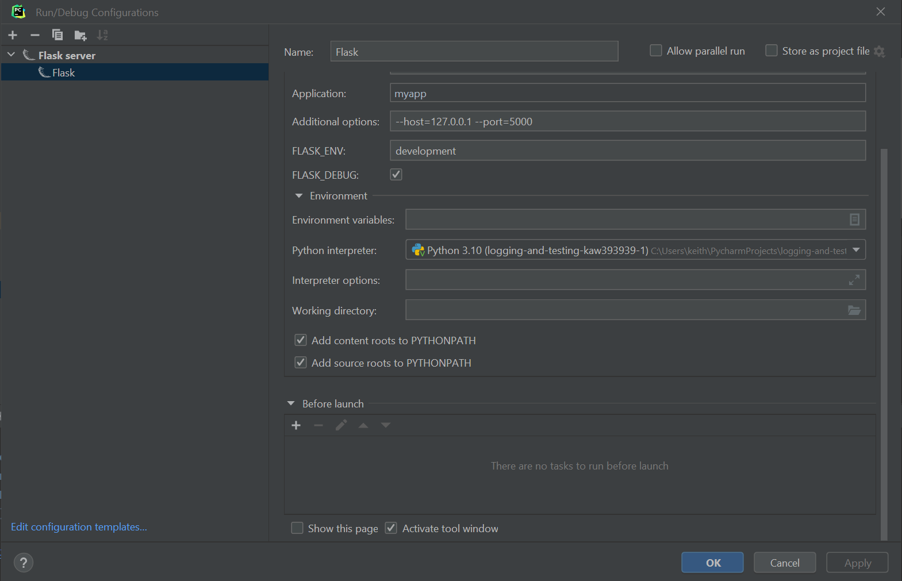

# Flask Open API (Swagger) UI Rest API Intro 

### Name: Diana Zawislak

### UCID: DZ29

## Introduction

The purpose of this unit is to introduce you to Open API (Swagger), flask, and how to implement a REST API with testing 

### Unit Video - [Watch Here](https://youtu.be/3KVeya0ufKk)
### Readings
1. [What is Open API Spec](https://www.techtarget.com/searchapparchitecture/definition/open-API-public-API)
2. [Flask RestX Tutorial](https://abhtri.medium.com/flask-api-documentation-using-flask-restx-swagger-for-flask-84be13d70e0)

### Assignment Tasks

For this assignment you need to complete the following five tasks and make the tests pass.

1. Test that the home page loads the swagger UI and the API returns 5 cities and the first city is Tokyo
2. Test that cities/<id> retrieves one city and that city is Tokyo and that the status code is 200 or a 404 if not found
3. Test that a post to cities inserts a record into the APIs data access object
4. Test that a post to cities updates a city record
5. Test that a city is deleted

## Steps to Complete the Assignment

1. Clone the repo, do pip install -r requirements.txt, and then pytest --pylint all the tests pass
2. Put your name in the README.MD as indicated above. If you don't do this you will get a 0.
3. Run pytest --pylint to see that the test tasks are failing currently and that you need to complete them
4. Setup Pycharm run configuration for flask 
5. Put the 5 assignment task tests in their respective test file i.e. put task 1 in test_task1.py
You get 20 points for each task.
6. Submit a link to your GitHub Classroom repository to the Canvas assignment i.e. the one with your github ID in it 

### References and Articles used for Assignment

1. [Flask Documentation](https://flask.palletsprojects.com/en/2.1.x/)
2. [Flask RestX](https://flask-restx.readthedocs.io/en/latest/)
3. [Open API Spec Home Page](https://www.openapis.org)